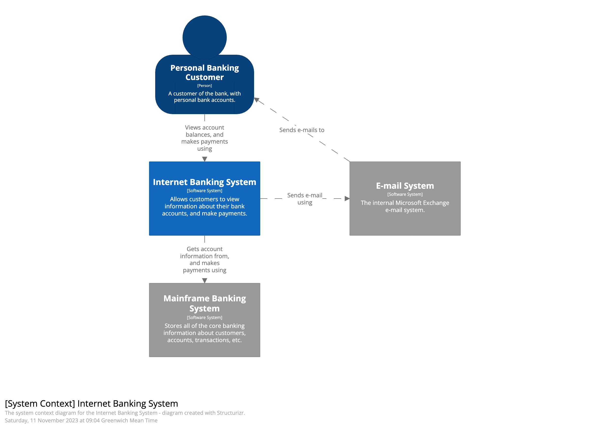
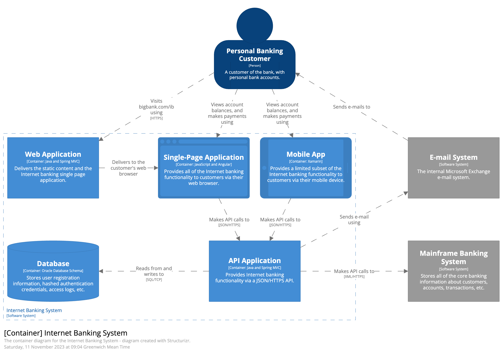
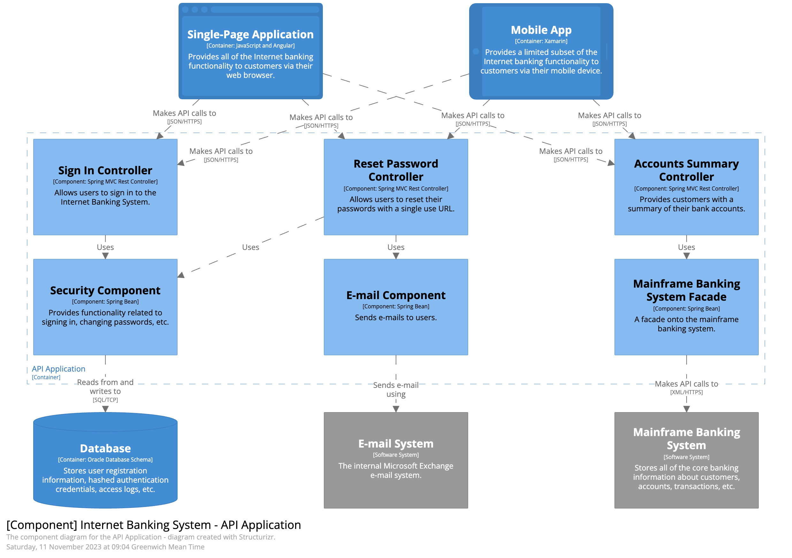
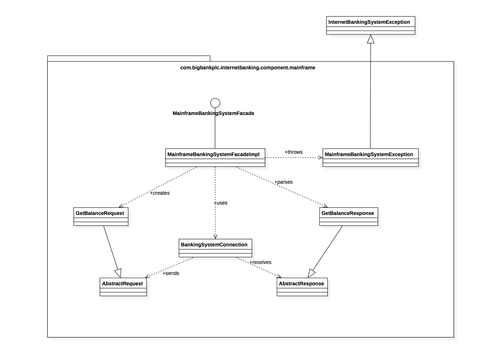

# Documentação ágil com C4 Model

Imagine que você peça para quatro desenvolvedores desenharem a mesma solução de e-commerce. É provável que surjam quatro desenhos diferentes, todos funcionais, mas cada um com seus próprios ícones, setas, formatos, legendas e caixas de texto.

O problema aparece na hora de explicar esses desenhos. Cada diagrama precisa deixar claro o contexto da aplicação, o nível de detalhe, os componentes envolvidos e os tipos de relacionamento. Sem um padrão mínimo, a documentação depende demais de quem desenhou e de quem está explicando.

A UML resolve parte desse problema, mas também traz uma complexidade que nem sempre combina com a rotina de times de produto. Muitas vezes precisamos de algo mais leve: fácil de aprender, amigável para desenvolvedores e útil para conversar com pessoas técnicas e não técnicas.

É nesse espaço que o C4 Model se encaixa. Ele propõe um conjunto de abstrações para documentar software em diferentes níveis, sem prender o time a uma notação ou ferramenta específica. Isso ajuda em discussões de arquitetura, onboarding, revisões técnicas e alinhamento entre desenvolvimento e produto.

## Mapeando o código

O C4 Model usa uma analogia parecida com mapas. Em um mapa, você pode observar o mundo inteiro, aproximar para um país, entrar em uma cidade e finalmente olhar uma rua específica. Com software, a ideia é a mesma: começar pela visão macro e aproximar apenas quando o detalhe agrega valor.

Essa visão é dividida em quatro níveis:

**Context (Level 1):** mostra o sistema em relação ao mundo ao redor. Aqui entram usuários, sistemas externos e dependências relevantes. É a visão ideal para explicar o propósito do sistema e suas principais interações sem entrar em detalhes técnicos.

**Containers (Level 2):** apresenta as grandes partes executáveis ou armazenamentos do sistema, como uma API, uma aplicação web, um aplicativo mobile, um banco de dados ou uma fila. O objetivo é explicar como essas partes se comunicam e quais responsabilidades cada uma possui.

**Components (Level 3):** detalha a estrutura interna de um container. Esse nível ajuda a explicar módulos, casos de uso, adaptadores, serviços internos ou outras partes relevantes do código. Ele é útil quando a conversa precisa sair da arquitetura geral e entrar no desenho interno de uma aplicação específica.

**Code (Level 4):** é o nível mais detalhado. Ele representa classes, interfaces, funções ou estruturas próximas do código-fonte. Normalmente é o nível menos usado em documentação contínua, porque o próprio código costuma ser a fonte mais atualizada desse detalhe.

O ponto principal é que você não precisa desenhar os quatro níveis sempre. O C4 é uma ferramenta de comunicação, então vale documentar apenas o que ajuda o time a tomar decisões, revisar arquitetura ou entender o sistema com menos atrito.

## Abstrações

O C4 Model é uma abordagem _abstraction-first_. As abstrações ajudam a simplificar a representação do sistema e permitem adicionar detalhes técnicos de forma gradual. Para construir esses diagramas, usamos alguns elementos principais:

### Pessoas

Pessoas representam usuários ou grupos que interagem com o software. Podem ser clientes, administradores, operadores, parceiros ou qualquer outro perfil relevante para o contexto.

### Sistema

Um software system representa algo que entrega valor para seus usuários. Pode ser o sistema que você está desenvolvendo ou outro sistema externo com o qual ele se relaciona.

### Container

Apesar do nome, container aqui não tem relação direta com Docker. No C4, um container representa uma aplicação ou armazenamento que roda separadamente dentro do sistema. Pode ser um back-end, front-end, banco de dados, fila, bucket, aplicação mobile, worker ou outro processo com responsabilidade própria.

### Componentes

No desenvolvimento de software, componente pode significar muitas coisas. No C4 Model, ele representa uma parte interna de um container: módulos, serviços, casos de uso, adaptadores, gateways ou outras unidades que ajudam a explicar como aquele container foi organizado.

## Como começar na prática

Comece pelo diagrama de contexto. Ele força uma conversa objetiva sobre quem usa o sistema, quais sistemas externos existem e onde estão as principais fronteiras.

Depois, avance para containers quando precisar explicar responsabilidades, integrações, deploys ou comunicação entre aplicações. Esse nível costuma entregar bastante valor porque conecta arquitetura com operação.

Use componentes apenas quando houver uma dúvida real sobre a estrutura interna de um container. Se o time já entende bem o código, talvez esse nível não seja necessário. Se existe confusão sobre módulos, dependências ou fluxos internos, ele pode evitar muitas explicações repetidas.

## Conclusão

O C4 é uma ótima ferramenta para comunicar e documentar arquiteturas em times pequenos ou grandes. Sua simplicidade ajuda desenvolvedores e demais pessoas interessadas a entenderem o sistema sem depender de uma explicação longa toda vez.

A manutenibilidade também é um ponto favorável. Existem ferramentas visuais, como o [draw.io](http://draw.io), e ferramentas baseadas em texto, como o Structurizr, que facilitam manter a documentação viva por mais tempo.

Fonte: C4model.com
